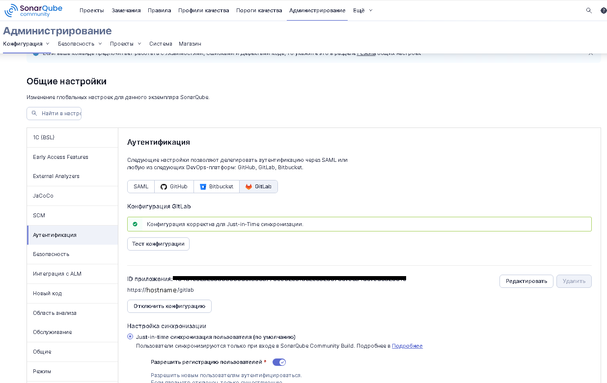

# Организация работы с Sonarqube

----
<div style="display: flex; justify-content: space-between">
<div>
<p><b>Автор</b>: Агибалов Сергей</p>
<p><b>Дата</b>: 08.10.2025</p>
</div>
<div><a href="https://yoomoney.ru/to/4100119287125731" style="Font-family: segoe script; Font-size: 20px; text-decoration: none; color: #000000; Font-weight: bold">Donate</a></div>
</div>

----

## Подготовка среды исполнения Sonarqube

Для разворачивания Sonarqube подойдет как виртуальная машина, так и LXC контейнер в рамках которых будет функционировать docker-контейнер. Для создания docker-контейнера необходимо развернуть **Docker engine**.

> [!NOTE]
> См. статью [**Создание LXC контейнера Linux на основе шаблона Turnkey**]() (*будет добавлена позже...*)

На виртуальной машине или на хостовой машине контейнера **LXC** необходимо проверить следующие параметры:

- [`vm.max_map_count`](https://www.kernel.org/doc/Documentation/sysctl/vm.txt) больше или равно чем ***524288***. Этот параметр содержит максимальное количество областей карты памяти для процесса, которое может иметь. Области карты памяти используются как побочный эффект вызова `malloc`, непосредственно через `mmap`, `mprotect` и `madvise`, а также при загрузке общей библиотеки. Хотя большинству приложений требуется менее тысячи карт, некоторые  программы, особенно отладчики `malloc`, могут потреблять их много, например, до одной или двух карт на распределение.

- [`fs.file-max`](https://www.kernel.org/doc/Documentation/sysctl/fs.txt) больше или равно чем ***131072***. Значение обозначает максимальное количество файловых дескрипторов, которые будет выделять ядро **Linux**.

- Ограничение на одновременно открытых файловых дескрипторов для пользователя, запускающего **Sonarqube** должно быть не меньше ***131072***.

- Ограничение на одновременно открытых файловых потоков для пользователя, запускающего **Sonarqube** должно быть не меньше ***8192***.

Просмотреть параметры можно с помощью следующих команд:

```bash
$> sysctl vm.max_map_count
$> sysctl fs.file-max
$> ulimit -n
$> ulimit -u
```

Для установки параметров `vm.max_map_count`, `fs.file-max` необходимо на хостовой машине изменить файл `/etc/sysctl.conf` (изменять параметры следует, только в том случае, если их текущие значения меньше требуемых), добавив в него необходимы значения:

```bash
$> echo "vm.max_map_count=524288" >> /etc/sysctl.conf
$> echo "sysctl -w fs.file-max=131072" >> /etc/sysctl.conf
```

После сохранения файла необходимо выполнить команду

```bash
$> sysctl -p
```

> Установка параметров `ulimit` будет выполнена в файле compose **Docker** (см. ниже).

После того, как проверка работы **Docker** успешно пройдена, необходимо создать образ **Sonarqube** с установленными внутри необходимыми плагинами. Для этого необходимо склонировать репозиторий проекта [1C-DevOps](https://github.com/agibalovsa/-1C_DevOps) по пути `/srv`.

```bash
$> cd /srv
$> git clone https://github.com/agibalovsa/-1C_DevOps 1c_devops
```

> Для работы с файлами можно использовать **nano**, а можно подключиться к созданной ОС через **Visual studio code**.

## Создание образа контейнера Sonarqube

В репозитории **dockerfile** для **Sonarqube** можно найти по пути [docker/sonarqube/build](..//..//..//../docker/sonarqube/build/dockerfile).

Для инициализации сборки необходимо запустить файл `docker/init.sh`.

Шаг.1. Откроется окно ввода названия проекта сборки


Шаг.2. Необходимо выбрать тип проекта `build`


Шаг.3. Необходимо выбрать приложение `sonarqube`


В каталоге репозитория `docker/users/builds/sonarqube` сформируются:

- `docker-build.sh` - Скрипт для сборки.
- `.arg` - Файл с аргументами сборки (Аргументы сборки описаны в [здесь](..//..//..//../docker/sonarqube/README.md#создание-образа)).


Для сборки образа необходимо:

1. Заполнить аргументы сборки можно согласно примеру на рисунке.
2. Запустить скрипт `docker-build.sh`.

## Запуск контейнера

### Инициализация compose

Файлы **compose** для **Sonarqube** можно найти в репозитории по пути [docker/sonarqube/compose](..//..//..//../docker/sonarqube/compose). Здесь можно увидеть:

- `common-compose.yml` - файл с параметрами развертывания среды общими для **compose** и для **swarm**.
- `docker-compose.yml` - файл с параметрами развертывания среды только для **compose**.
- `depends_on_postgres/depends_on_postgres-compose.yml` - файл приоритета запуска, в случае запуска **sonarqube** вместе с **postgres**.>

> [!NOTE]
> Файлы **compose** созданы согласно [документации **Sonarqube**](https://docs.sonarsource.com/sonarqube-server/latest/server-installation/from-docker-image/starting-sonarqube-container).

Файлы **compose** для **Postgres** можно найти в репозитории по пути [docker/postgres/compose](..//..//..//../docker/postgres/compose).

Для формирования скриптов запуска контейнера необходимо снова запустить `docker/init.sh`.

Шаг.1. Откроется окно ввода названия проекта сборки.

Шаг.2. Необходимо выбрать тип проекта `compose`.


Шаг.3. Можно выбрать 1 или 2 приложения: `sonarqube` и `postgres`.


> [!NOTE]
> Приложение **postgres** можно не выбирать, если оно уже установлено, и путь до него известен

Шаг.4. В случае установки 2х приложений необходимо выбрать дополнительную настройку `depends_on_postgres`


В каталоге репозитория `docker/users/compose/sonarqube` сформируются:

- `docker-compose-up.sh` - Скрипт развертывания среды.
- `docker-compose-down.sh` - Скрипт свертывания среды.
- `docker-compose-logs.sh` - Скрипт просмотра логов среды.
- `.env` - Файл с переменными среды (Переменные среды запуска описаны в [здесь](..//..//..//../docker/sonarqube/README.md#создание-контейнера)).

### Переменные среды

Переменные среды выполнения [**Postgres**](https://hub.docker.com/_/postgres):

- `POSTGRES_USER`, `POSTGRES_PASSWORD` - задает имя и пароль, пользователя для доступа к базе данных.
- `POSTGRES_DATA_PATH` - задает путь к данным кластера **Postgres**.

Параметры среды выполнения [**Sonarqube**](https://docs.sonarqube.org/latest/setup/environment-variables/):

- `SONAR_JDBC_URL` - задает строку соединения с **Postgres**.
- `SONARQUBE_JDBC_USERNAME` , `SONARQUBE_JDBC_PASSWORD` - Логин и пароль для пользователя **JDBC**, которому предоставляются разрешения на создание таблиц, индексов и триггеров.
- `SONAR_WEB_JAVAOPTS` - веб-сервер выполняется в выделенном процессе Java. Этот параметр используется для настройки параметров **JVM**.
- `SONAR_CE_JAVAOPTS` - процесс **Compute Engine** отвечает за обработку фоновых задач и выполняется в специальном процессе Java. Этот параметр используется для настройки параметров **JVM**.
- `SONAR_SEARCH_JAVAOPTS` - **Elasticsearch** используется для обеспечения быстрого и точного поиска информации. Он выполняется в специальном процессе Java. Этот параметр используется для настройки параметров **JVM**.
- `SONAR_WEB_CONTEXT` - задается, если путь к сервису идет через дополнительные локали, например, нужно задать значение `/sonarqube` если **URL** имеет следующий вид <https://hostname/sonarqube>.

### Тома

Тома для docker-контейнера **Sonarqube**:

- `sonarqube_data` – содержит файлы данных, такие как встроенная база данных **H2** и индексы **Elasticsearch**.
- `sonarqube_logs` – содержит журналы SonarQube о доступе, веб-процессах, процессах **CE** и **Elasticsearch**.
- `sonarqube_ext` – содержит любые установленные плагины и драйвер **Oracle JDBC**.
- `sonarqube_conf` - содержит файлы настроек для **Sonarqube**.

Тома для docker-контейнера **Postgres**:

- `postgres_data` – содержит файлы данных кластера **Postgres**.

### Дополнительные настройки common-compose.yml

Так как во время работы **sonarqube** может происходить анализ хранилища с большим числом файлов, то в файле **compose** настройки ограничения количества дескрипторов файлов:

```yaml
ulimits:
  nofile:
    soft: 131072
    hard: 131072
```

## Начальный вход в Sonarqube

Чтобы убедиться, что **Sonarqube** работает, необходимо обратиться к нему по веб-адресу <http://hostname:port/sonarqube>, где

- `hostname` - это хостовое имя виртуальной машины или **LXC** контейнера, в рамках которой функционирует docker-контейнер;
- `port` - это порт, который был задан в файле `common-compose.yml`.
- `/sonarqube` - если задана переменная среды окружения `SONAR_WEB_CONTEXT`


Первоначальные учетные данные **admin**/**admin**.

## Обновление контейнера Sonarqube

Перед [обновлением](https://docs.sonarsource.com/sonarqube-server/latest/server-upgrade-and-maintenance/upgrade/roadmap/) обязательно нужно сделать архив всей инфраструктуры.

На скриншоте показан бэкап **LXC**-контейнера в **Proxmox**.


После создания архива необходимо выполнить следующие шаги:

1. Свернуть инфраструктуру compose с помощью скрипта `docker-compose-down.sh`. При этом все данные **Sonarqube** не удалятся, так как лежат в прописанных томах.

2. [Определить](https://docs.sonarsource.com/sonarqube-server/server-update-and-maintenance/update/release-cycle-model) ближайшую версию **Sonarqube** на которую можно обновиться.

3. Необходимо проверить наименование переменных среды, и исправить **dockerfile**, файлы **compose** в случае необходимости

   > При переходе с 8.9 на 9.9 были переименования с `SONARQUBE_JDBC_URL` на `SONAR_JDBC_URL`.

4. Изменить `.arg`, в котором указать:

   - новую версию **Sonarqube**
   - новую версию плагинов
   - новое имя образа

   ```dockerfile
   SONAR_REPO="sonarqube"
   SONAR_VERSION="25.8.0.112029-community"
   RUSSIAN_PACK_VERSION="25.1"
   BSL_PLUGIN_VERSION="1.16.1"
   BRANCH_PLUGIN_VERSION="25.7.0"
   
   SONAR_TAG="sonarqube/bsl:${SONAR_VERSION}-${BSL_PLUGIN_VERSION}"
   ```

5. Создать новый образ **Sonarqube** с указанной ранее версией

   ```bash
   $> ./docker-build.sh
   ```

6. Изменить файл `.env` среды **compose**

   ```yaml
   SONAR_TAG="sonarqube/bsl:25.8.0.112029-community-1.16.1"
   ```

7. Запустить новый **docker-контейнер**

   ```bash
   $> ./docker-compose-up.sh
   ```

8. После запуска в веб-интерфейсе **Sonarqube** выйдет сообщение об техническом обслуживание. Для его выполнения нужно в браузере указать путь <http://hostname/sonarqube/setup> (путь `/sonarqube` - опционально). После чего откроется страница с предложением обновить базу данных. После подтверждения запустится обновленная версия **Sonarqube**, в веб-интерфейсе возникнут соответствующие сообщения.

## Настройка revers-proxy для Nginx

Для настройки проксирования с внешнего доменного имени, например <http://hostname/sonarqube>, на внутреннее доменное имя, например <http://sonarqube>, необходимо:

1. Задать переменную среды `SONAR_WEB_CONTEXT` в файле `.env`

   ```ini
   SONAR_WEB_CONTEXT="/sonarqube"
   ```

2. Задать настройки проксирования для **nginx**

   ```ini
     location /sonarqube/ {
   
       client_max_body_size 5000M;
   
       proxy_set_header Host $host;
       proxy_set_header X-Real-IP $remote_addr;
       proxy_set_header X-Forwarded-For $proxy_add_x_forwarded_for;
       proxy_set_header X-Forwarded-Proto $scheme;
       proxy_set_header X-Forwarded-Protocol $scheme;
       proxy_set_header X-Url-Scheme $scheme;
   
       proxy_pass http://sonarqube;
   
     }
   ```

## Настройка интеграции с Gitlab

### Проверка связи между сервисами

После того, как запуск сервиса был успешно реализован, и вход был выполнен, необходимо настроить интеграцию с инструментом управления жизненным циклом. В рамках данной документации будет описана интеграция с **[Gitlab](https://docs.sonarqube.org/9.4/analysis/gitlab-integration/)**.

Перед началом интеграции необходимо проверить, что сервис **Gitlab** доступен по своему доменному имени со стороны **Sonarqube**, а **Sonarqube** доступен по своему имени со стороны **Gitlab**. Лучше всего связь указывать через доменные имена, т.к. все ссылки для перехода из одного сервиса в другой будут строиться именно по доменным именам, это намного проще, чем по **IP** адресам.

Чтобы проверить доступность **Gitlab** со стороны **Sonarqube** необходимо провалиться внутрь контейнера, для этого нужно получить идентификатор контейнера

```bash
$> docker ps
```

```bash
CONTAINER ID   IMAGE                            COMMAND                  CREATED        STATUS        PORTS                     
a341e3e840d0   sonarqube/bsl:25.8.0             "/opt/sonarqube/bin/…"   17 hours ago   Up 17 hours   0.0.0.0:80->9000/tcp, 
c7b5ece1cf1f   postgres:15                      "docker-entrypoint.s…"   17 hours ago   Up 17 hours   5432/tcp                   
95359d7a1eee   gitlab/gitlab-runner:latest      "/usr/bin/dumb-init …"   2 months ago   Up 23 hours                             
```

Далее идентификатор `CONTAINER ID` необходимо вставить в команду `docker exec`, также в ней необходимо указать параметр для использования **root** прав `-u 0`

```bash
$> docker exec -u 0 -it a341e3e840d0 bash
```

После чего необходимо выполнить `ping` сервиса **Gitlab**

```bash
$> ping gitlab
```

```bash
PING gitlab (192.168.0.1): 56 data bytes
64 bytes from gitlab (192.168.0.1): seq=0 ttl=63 time=0.227 ms
64 bytes from gitlab (192.168.0.1): seq=1 ttl=63 time=0.214 ms
64 bytes from gitlab (192.168.0.1): seq=2 ttl=63 time=0.295 ms
```

То же самое необходимо проделать для **Gitlab**.

```bash
$> ping sonarqube
```

```bash
PING sonarqube (192.168.0.2) 56(84) bytes of data.
64 bytes from sonarqube (192.168.0.2): icmp_seq=1 ttl=64 time=0.155 ms
64 bytes from sonarqube (192.168.0.2): icmp_seq=2 ttl=64 time=0.114 ms
64 bytes from sonarqube (192.168.0.2): icmp_seq=3 ttl=64 time=0.203 ms
```

После проверки доменных имен необходимо указать параметр `Server base URL` в общих настройках **Sonarqube**


По сути дела, он должен быть таким же, как путь в браузере.

### Генерация токенов Gitlab

Для [интеграции с Gitlab](https://docs.sonarqube.org/latest/analysis/gitlab-integration/) необходимо сгенерировать 2 токена:

1. Для авторизации в **Sonarqube** через **Gitlab**
2. Для доступа к проектам **Gitlab**

#### Авторизация в **Sonarqube** через **Gitlab**

Первый токен для авторизации необходимо сделать для приложения **Gitlab**. Для этого необходимо зайти в панель `Admin` в `Applications`.


Далее необходимо создать новое приложение с помощью кнопки `New application`, задав следующие настройки

- `Name` – имя приложения, например, **Sonarqube**.
- `Redirect URI` – путь перенаправления запроса для входа <https://hostname/sonarqube/oauth2/callback/gitlab> (локаль `/sonarqube` задается опционально).
- `Trusted` - `Истина` - Доверенные приложения автоматически авторизуются в потоке **GitLab OAuth**.
- `Confidential` - `Истина` - Приложение будет использоваться там, где секрет клиента может быть конфиденциальным.
- `Scopes` - `api` - для синхронизации групп.
- `Scopes` - `read_user` - для авторизации через **GitLab**.

После генерации токена необходимо скопировать `Application ID` и `Secret`.


#### Доступ к проектам **Gitlab**

Второй токен необходимо сгенерировать под тем пользователем, из под которого будут выполняться доступ в **Gitlab** из **Sonarqube**. При этом со стороны **Sonarqube**, будут доступны именно те проекты, которые доступны данном пользователю.

Для этого, необходимо авторизоваться под этим системным пользователем и зайти в настройки профайла и далее в раздел `AccessTokens`.


Далее необходимо создать новый токен с помощью кнопки `Create personal access token`, задав следующие настройки

- `Token name` – имя токена, например, **Sonarqube**.
- `Expiration date` - `Пустая дата` - Дата истечения срока действия токена.
- `Scopes` - `api` - право для доступа к проектам, группам, реестру контейнеров и дистрибутивов.

После генерации токена, его необходимо скопировать сразу же, иначе, позже он не будет больше доступен.


## Настройка интеграции с ALM в Sonarqube

После генерации токенов, необходимо зайти в **Sonarqube** под правами администратора и перейти на вкладку `Администрирование` - `Конфигурация` - `Общие настройки` - `Интеграции с ALM`. Откуда необходимо перейти на вкладку `Gitlab`.

1. Настройка конфигурации интеграции.

   

   1. Необходимо нажать кнопку `Создать конфигурацию`.
   2. Ввести имя конфигурации, например, *Gitlab*.
   3. Ввести адрес `GitLab API`, который состоит из доменного имени сервиса **Gitlab** и приписки `api/v4/`. Например, <https://hostname/gitlab/api/v4/> (`hostname/gitlab` - это некий **URL** до внутреннего сервера **gitlab**).
   4. Ввести значение `Access token`, которое мы генерировали для системного пользователя.
   5. После создания конфигурации, необходимо проверить корректность параметров, с помощью кнопки `Проверка конфигурации`.

2. Аутентификация **GitLab**.

   

   1. Необходимо задать путь к сервису **Gitlab**, который будет состоять из доменного имени. Например, <https://hostname/gitlab>.
   2. Необходимо заполнить `Application ID` сгенерированным раннее значением.
   3. Необходимо заполнить `Secret`  сгенерированным раннее значением.
   4. `Allow users to sign-up` - позволяет регистрироваться через **Sonarqube** новым пользователям.
   5. `Synchronize user groups` - при совпадении имен групп в **Gitlab** и **Sonarqube**, группы сопоставляются.

3. Настройка с помощью **API** **Sonarqube**

   Ниже приведен пример скрипта настройки аутентификации через **REST API**.

   ```powershell
   adminuser="admin"
   adminpassword="password"
   baseurl="https://hostname/sonarqube"
   enabled=true
   gitlaburl="http://hostname/gitlab/"
   appid="<Application ID>"
   secret="<Secret>"
   allowsignup=true
   
   curl -u $adminuser:$adminpassword -X POST "$baseurl/api/settings/set?key=sonar.core.serverBaseURL&value=$baseurl"
   curl -u $adminuser:$adminpassword -X POST "$baseurl/api/settings/set?key=sonar.auth.gitlab.enabled&value=$enabled"
   curl -u $adminuser:$adminpassword -X POST "$baseurl/api/settings/set?key=sonar.auth.gitlab.url&value=$gitlaburl"
   curl -u $adminuser:$adminpassword -X POST "$baseurl/api/settings/set?key=sonar.auth.gitlab.applicationId.secured&value=$appid"
   curl -u $adminuser:$adminpassword -X POST "$baseurl/api/settings/set?key=sonar.auth.gitlab.secret.secured&value=$secret"
   curl -u $adminuser:$adminpassword -X POST "$baseurl/api/settings/set?key=sonar.auth.gitlab.allowUsersToSignUp&value=$allowsignup"
   ```

## Добавление нового проекта в Sonarqube

### Загрузка нового проекта из Gitlab

После успешного создания конфигурации интеграции с **Gitlab** можно добавить в **Sonarqube** необходимы проекты. Для этого необходимо:

1. Перейти на вкладку `Проекты`, и нажать кнопку `Создать проект` - `Gitlab`.

2. Выйдет окно ввода токена доступа

   

3. В этот раз нужно сгенерировать теперь токен доступа также как в разделе [Доступ к проектам **Gitlab**](#доступ-к-проектам-gitlab), но только для текущего пользователя (а не системного)

   - И право **`Scope`** для доступа к проектам должно быть `read_api`, а не `api`.

4. После ввода персонального токена выйдет список проектов из **Gitlab**, необходимо выбрать нужный.

> [!WARNING]
> Проверьте, что в **Gitlab** необходимые проекты доступны и текущему и системному пользователям.

   

5. При нажатии на кнопку `Импорт`, необходимо указать настройку соответствия чистому коду. Можно спокойно указывать `Использовать глобальную настройку`.

6. На следующем шаге необходимо указать метод анализа **Gitlab CI**.

   

7. После чего откроется окно задания настроек интеграции с **Gitlab**

   

   1. Сгенерировать токен доступа `SONAR_TOKEN` к **Sonarqube** из **Gitlab-runner**:

      - Его можно сгенерировать индивидуально для проекта из текущего окна

      - Можно сгенерировать общий для нескольких проектов из настроек учетной записи пользователя с администраторскими правами.

        

   2. Задать переменные в `SONAR_HOST_URL` и `SONAR_TOKEN` в **Gitlab**(см. ниже).

   3. Перенести настройки проекта в файл `sonar-project.properties`(см. ниже)

      ```ini
      sonar.projectKey=gr_1c_cicd_987d39dd-958e-4490-b0f2-cb97b6d9355c
      sonar.qualitygate.wait=true
      ```

   4. Сверить настройки с файлом `.gitlab-ci.yml` (см. ниже).

### Настройка выполнения проверки Sonarqube из репозитория Gitlab

В **Gitlab** можно настроить различные события, при возникновении которых запускается проверка **Sonarqube**. Обычно это:

- Создание запроса на слияние
- Выполнение фиксации в определенных ветках репозитория.
- Создание тега

Сама проверка происходит  с помощью специальной утилиты **Sonar scanner**. Данная утилита не обязана находиться на той же машине, что и сервис **Sonarqube**. **Gitlab** запускает **Sonar scanner**, который получает все изменения относительно последней проверки, производит анализ, и данные передает в сам сервис **Sonarqube**, который отображает их в удобном для анализа формате. Для оптимальной выполнение проверки, мы будем выполнять **Sonar scanner** в **Docker**-контейнере.

Для выполнения проверки необходимо настроить 2 файла конфигурации: `sonar-project.properties` и `.gitlab-ci.yml`.

#### Настройка переменных CICD в Gitlab

В **Gitlab** необходимо создать 2 переменных среды `SONAR_HOST_URL` и `SONAR_TOKEN`. Их можно создать в трех местах:

- В общих настройках `Admin` - `Settings` - `CI/CD` - `Variables`
- В настройках группы
- В настройках проекта


Параметры переменных

- `SONAR_HOST_URL`
  - `Value` - Доменное имя сервиса **Sonarqube** - <http://hostname/sonarqube>
  - `Protected` - False
  - `Masked` - False
- `SONAR_TOKEN`
  - `Value` - Токен пользователя **Sonarqube** который был создан на предыдущем шаге настройки проекта
  - `Protected` - False
  - `Masked` - True

> [!IMPORTANT]
> Если значение для `SONAR_TOKEN`было сгенерировано индивидуально для проекта, то его следует разместить в переменных CICD проекта, иначе значение следует разместить в в общих переменных CICD или в переменных группы.

#### Настройка файла конфигурации проекта `sonar-project.properties`

В файле [`sonar-project.properties`](https://docs.sonarqube.org/latest/analysis/scan/sonarscanner/) необходимо определить следующие параметры:

- `sonar.projectKey` - ключ проекта, который мы запомнили ранее.

- `sonar.qualitygate.wait` - флаг ожидания окончания проверки в **Sonarqube.**

- `sonar.projectName` - Имя проекта, которое генерируется, при его получении из **Gitlab**.

- `sonar.projectVersion` - Текущая версия проекта, требуется при использовании одной из стратегий отделения старого кода от нового.

- `sonar.host.url` - (не обязательно) - доменное имя сервиса **Sonarqube**.

- `sonar.login` - (не обязательно)  - токен для авторизации в **Sonarqube**.

> [!NOTE]
> Параметры `sonar.host.url` и `sonar.login` указываются если на сервере **Sonarqube** включено требование принудительной авторизации и/или запрет анонимного анализа проектов.

- `sonar.sourceEncoding` - кодировка файлов проекта.

- `sonar.sources` - пути к файлам проекта.

> [!CAUTION]
> - Все русскоязычные пути должны быть [преобразованы](https://unicode-table.com/ru/tools/decoder/) в юникод формат.
> - Для проектов 1С, необходимо указать путь к файлам основной конфигурации, и пути к файлам каждого расширения отдельно.

- `sonar.inclusions` - те файлы, которые необходимо анализировать.

- `sonar.exclusions` - те файлы, которые необходимо пропускать при проверке.

> [!TIP]
> Для проектов 1С сюда можно прописать файлы регламентированной отчетности, что сократит время проверки типовых конфигураций в разы.

- `sonar.lang.patterns.xml` -  определяет какие файлы относятся к **xml**.

- `sonar.bsl.languageserver.skipSupport` - Пропускать файлы на полной поддержке поставщика, со статусом `Не редактируется` (Настройка относится к плагину [SonarQube 1C (BSL) Community Plugin](https://1c-syntax.github.io/sonar-bsl-plugin-community/)).

```ini
# Основные настройки

# Ключ проекта. Уникальный в пределах сервера SonarQube
sonar.projectKey=gr_project_ec24596ee-92cd-441b-9ff2-78a24df43e31b
sonar.qualitygate.wait=true
sonar.projectName=project
sonar.projectVersion=1.0.0.1
# sonar.host.url=https://hotname/sonarqube
# sonar.login=UserToken

# Кодировка файлов исходных кодов.
sonar.sourceEncoding=UTF-8

# Путь к исходным кодам. Относительные пути разрешаются от файла sonar-project.properties
# В качестве разделителя пути используется прямой слэш - /. Можно указать несколько каталогов через запятую.
# https://symbl.cc/ru/tools/decoder/
sonar.sources=src/cf, src/cfe/ExtName

# Фильтры на включение в анализ. В примере ниже - только bsl и os файлы.
sonar.inclusions=**/*.bsl,**/*.os
sonar.exclusions=**/*.html,**/*.xml,**/Reports/\u0420\u0435\u0433\u043b\u0430\u043c\u0435\u043d\u0442\u0438\u0440\u043e\u0432\u0430\u043d\u043d*/**/*.*
sonar.lang.patterns.xml=**/*.xsd,**/*.xsl

# Настройки плагина SonarQube 1C (BSL) Community Plugin

# Пропускать файлы на полной поддержке поставщика, со статусом "Не редактируется" 
sonar.bsl.languageserver.skipSupport=with support
```

#### Настройка файла конфигурации проекта `.gitlab-ci.yml`

Для автоматического запуска сканирования **Sonarqube** из **Gitlab** необходимо в корне репозитория проекта создать файл `.gitlab-ci.yml`. Сканирование проекта будет происходить с помощью утилиты **Sonar scanner** в **Docker-контейнере**. Для этого в файле `.gitlab-ci.yml` необходимо [определить](https://docs.sonarqube.org/9.4/analysis/gitlab-integration/#header-4) следующие параметры:

- `tags` - тег **gitlab-runner**, который запустит проверку **sonar scanner**.
- `stage` - Этап проверки **Sonarqube**.
- `image` - образ **Sonar scanner** из репозитория [**Docker Hub**](https://hub.docker.com/).
- `variables` - переменные сканирования репозитория.
- `cache` - параметры задания кэша сканирования репозитория.
- `script` - дополнительные параметры сканирования репозитория:
  - `sonar.qualitygate.wait` - признак ожидания окончания сканирования;
  - `sonar.qualitygate.timeout` - таймаут, после которого сканирование прерывается.

- `allow_failure` - признак разрешения ошибок при сканировании.
- `rules` - перечисление условий и веток, где происходит сканирование:
  - `merge_request_event` - сканирования запроса на слияние;
  - `master` - сканирование ветки master;
  - `'/^codereview.*$/'` - сканирование веток, начинающихся со слова *codereview*.

```yaml
stages:
  - sonarqube-check

sonarqube-check:
  tags:
     - sonar
  stage: sonarqube-check
  image: 
    name: sonarsource/sonar-scanner-cli:latest
    entrypoint: [""]

  variables:
    SONAR_USER_HOME: "${CI_PROJECT_DIR}/.sonar"  # Defines the location of the analysis task cache
    SONAR_SCANNER_OPTS: "-Xmx16g"
    GIT_DEPTH: "0"  # Tells git to fetch all the branches of the project, required by the analysis task

  cache:
    policy: pull-push
    key: "sonar-cache-$CI_COMMIT_REF_SLUG"
    paths:
      - "${SONAR_USER_HOME}/cache"
      - sonar-scanner/

  script: 
    - sonar-scanner -Dsonar.host.url="http://gitlab.raft.ru:9001/sonarqube" -Dsonar.qualitygate.wait=true -Dsonar.qualitygate.timeout=1800
  allow_failure: true

  rules:
    - if: $CI_PIPELINE_SOURCE == 'merge_request_event'
    - if: $CI_COMMIT_BRANCH == 'master'
    - if: $CI_COMMIT_BRANCH =~ '/^codereview.*$/'
```

### Настройка Gitlab-runner для запуска Sonarqube

Запуск заданий автоматизации происходит с помощью **Gitlab runner**, выполнением которого управляет сервис **Gitlab**. Можно запустить сколько угодно экземпляров **Gitlab runner**, которые будут выполняться на разных машинах. Для оптимального подбора мощностей для выполнения заданий мы будем выполнять [**Gitlab runner** в **Docker-контейнере**](https://docs.gitlab.com/runner/install/docker.html).

Для этого нам необходимо:

1. Создать **runner** в **Gitlab**

   - Переходим `Admin` -  `CI/CD`

     

   - Создаем новый **runner**

     - Указываем `tag` *sonar*
     - Указываем описание
     - Указываем таймаут *1800*

   - После создания runner выходит информация о регистрации, запомним ее

     

2. Настроить **runner** на машине исполнения

> [!NOTE]
> Можно настроить на той же машине, где настроен sonarqube.

   - **Runner** будет настроен через среду **compose**

   - Создаем том для хранения настроек

     ```bash
     $> docker volume create gitlab-runner-config
     ```

   - Создаем контейнер

     ```bash
     $> docker run -d --name gitlab-runner --restart always \
         -v /var/run/docker.sock:/var/run/docker.sock \
         -v gitlab-runner-config:/etc/gitlab-runner \
         gitlab/gitlab-runner:latest
     ```

   - Также контейнер можно создать с помощью файла **compose** через скрипт инициализации [init.sh](#запуск-контейнера)
     - Шаг.1. Откроется окно ввода названия проекта сборки.
     - Шаг.2. Необходимо выбрать тип проекта `compose`.
     - Шаг.3. Необходимо выбрать приложение **Gitlab**.
     - Шаг.4. Необходимо выбрать настройку **gitlab-runner**.
     - В каталоге репозитория сформируется файл`docker/users/compose/sonarqube/docker-compose-up.sh`, при запуске которого запустится контейнер **gitlab-runner**.

3. Связать созданный контейнер с **runner** в **Gitlab**.

   - Берем информацию о регистрации из шага 1
   - Выполняем команду **docker**, после чего запускается скрипт регистрации

   ```bash
    $> docker run --rm -it -v gitlab-runner-config:/etc/gitlab-runner gitlab/gitlab-runner:latest register --url https://hostname/gitlab  --token glrt-t1_uq6DG1oiaxFHsHz6yJc5
   ```

   ```bash
   Runtime platform                                    arch=amd64 os=linux pid=7 revision=f761588f version=14.10.1
   Running in system-mode.                                                                        
   Enter the GitLab instance URL (for example, https://gitlab.com/):
   [https://hostname/gitlab]:
   
   Enter the registration token:
   [glrt-t1_uq6DG1oiaxFHsHz6yJc5]:
   
   Enter a description for the runner:
   [46e5dc60b5d2]: sonarqube
   
   Enter tags for the runner (comma-separated):
   sonar
   
   Enter optional maintenance note for the runner:
   Sonarqube runner
   
   Registering runner... succeeded                       runner=iq_v67v_32WedRR
   
   Enter an executor: virtualbox, docker+machine, custom, parallels, shell, docker-ssh+machine, kubernetes, docker, docker-ssh, ssh:
   docker
   
   Enter the default Docker image (for example, ruby:2.7):
   sonarsource/sonar-scanner-cli:latest
   
   Runner registered successfully. Feel free to start it, but if it's running already the config should be automatically reloaded!
   ```

   - В процессе регистрации необходимо указать:

     - `GitLab instance URL` - (уже заполнен) - указывается доменное имя сервиса.

     - `Registration token` - (уже заполнен) - указывается ключ регистрации **runner**. Его можно посмотреть в свойствах CI/CD проекта.

     - `Description for the runner` - описание **runner**.

     - `Tags for the runner` - тэги, согласно которым сервис **Gitlab** может вызывать доступные **runner**, если их зарегистрировано несколько.

     - `Optional maintenance note for the runner` - опциональная заметка.

     - `Executor` - исполнитель, который будет запускать **runner**, в нашем случае - это **docker**-контейнер.

     - `Default Docker image` - в случае указания значения **docker**, необходимо указать имя контейнера по-умолчанию, который будет создаваться при выполнении **runner**, если данный контейнер не указали в `.gitlab-ci.yml`.

4. Если runner уже был создан, то его можно привязать к проекту через его настройки

Также в кабинете **gitlab** настройках ранее зарегистрированного **runner**  можно указать какие проекты он обслуживает.


### Первый запуск проверки Sonarqube

После того, как были:

- заданы все настройки
- созданы файлы `sonar-project.properties` и `.gitlab-ci.yml`
- зарегистрирован **Gitlab runner**

необходимо зафиксировать изменения в **git**-репозитории и отправить их в **Gitlab**. В этот момент запустится первая проверка.

----

<div style="display: flex; justify-content: space-between">
<div>
<p><b>Почта</b>: agibalovsa@gmail.com</p>
<p><b>Telegram</b>: @agibse</p>
</div>
<div><a href="https://yoomoney.ru/to/4100119287125731" style="Font-family: segoe script; Font-size: 20px; text-decoration: none; color: #000000; Font-weight: bold">Donate</a></div>
</div>

----
